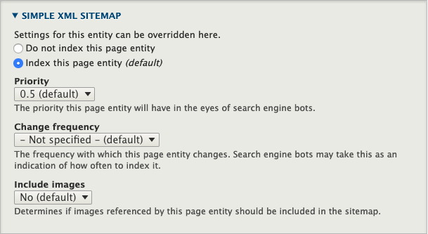

# Development

- [Development](#development)
    - [Modules](#modules)
        - [Updating Dropsolid modules](#updating-dropsolid-modules)
    - [Features](#features)
        - [Config](#config)
        - [Functional](#functional)
            - [READ EVERY SINGLE README IN EVERY SINGLE CUSTOM MODULE.](#read-every-single-readme-in-every-single-custom-module)
    - [Blocks](#blocks)
    - [Paragraphs](#paragraphs)
        - [Mixing it up](#mixing-it-up)
    - [Site building](#site-building)
                - [Layout Builder](#layout-builder)
                - [Homepage construction (Flex only)](#homepage-construction-flex-only)
                - [Facets](#facets)
                    - [Creating a Facet:](#creating-a-facet)
                    - [Adding a Facet to your page](#adding-a-facet-to-your-page)


## Modules

### Updating Rocketship modules

Currently unsupported (alpha), but the plan is that they will work the same as any
normal contrib module.

Important to note is that most patches are inside this distribution's
dependencies.

One bug that sometimes crops up with dependency patches, is that composer
doesn't pick them up immediately (if, say, a new release has an extra patch).
Either check the composer log or the composer.lock/installed.json to make sure all patches
are applied properly, or run your update command twice.

If, due to updates, you no longer need a patch but it is required by a contrib
module such as Rocketship Core you can ignore it by using the ignore-patches
functionality of the [composer-patches package](https://github.com/cweagans/composer-patches).

### Patching contributed modules

Due to the switch to gitlab on drupal.org, finding and applying patches to
contrib modules is no longer as straightforward as it once was.
Because patchfiles change along with updates to their merge requests, we need
to download them to the project repo as explained below.

* Find or create the issue on drupal.org.
* If there is no merge request, [create one](https://www.drupal.org/docs/develop/git/using-git-to-contribute-to-drupal/creating-issue-forks-and-merge-requests)
* [Download the patch file](https://www.drupal.org/docs/develop/git/using-git-to-contribute-to-drupal/creating-issue-forks-and-merge-requests#s-downloading-a-patch-file-from-a-merge-request) to etc/patches/
    * Make sure to include the issue number in the patch file
* Add it to your composer.json **with the issue number** and a short description like so:
```
"patches": {
  "drupal/module_name": {
    "12345678 - This is a short description": "etc/patches/12345678.patch"
  }
}
```

## Features

### Config

**Features, as a Drupal concept, should not be used to manage configuration
anymore.**

We use Drupal's Config Management system.

### Functional

**From here on out**, the term **'Features'** will just be used to talk about
ready-to-use functionality that is added to our sites.
These are added using Dropsolid custom modules, installed with the Skeleton and
enabled during installation or afterwards.

With the latest release of Rocketship, we've removed all previous Features. We
will need time to rebuild them using Layout Builder instead of Paragraphs.

Currently we only have the Basic Page content type, but you can accomplish a lot
of things with just it and all of our custom block types for use in Layout Builder.

## Blocks

#### FAQ
Create a list of frequently asked questions and answers on a specific page, with a classic FAQ-styling.

#### Focus
Add a block with a striking look-and-feel, with a clear call-to-action to boot. Ideal for content you want to emphasize.

#### Forms
Place one of your forms on your page.

#### Image
Add an image to your section. The image can be stretched to break out of its container (or column) if needed.

#### Menu Overview
Select a menu to show it on the page, or select "current page" to show menu items from the main menu that are below this page.

#### Photo Gallery
Add images to your page in a clean, mobile-friendly way. Choose between a simple grid or a fancy masonry effect.

#### Related Items
Select other pages that are related to this one, and they'll be shown in a visually interesting list.

#### Testimonial
Show a quote of a customer with an optional small profile picture, name and function.

#### Text
Add a block of text with some optional fields, such as title, teaser, …

#### Title
Add the title of your node, in the heading tag of your choice. Include optional fields such as subtitle and teaser.

#### USP
Add blocks of this type to your section, to construct a list of the strong points of your company, product or service.

#### Video
Integrate a YouTube or Vimeo video on your page.

## Site building

##### Layout Builder

For the basic page content type, Layout Builder is the way to go. And we still use basic pages
with Layout Builder to create overview/landing pages. But now we don't need an intermediate
overview Paragraph, we can simply embed the corresponding views/facets etc directly using
Layout Builder.

We've added a fair few additions to the Layout Builder experience after having ran our own
UX feedback trials.

- No sidebar. As soon as a CkEditor field pops up, it becomes unworkable. So we've made sure all
Layout Builder forms open in a modal instead.
- Expanded previews. We've replaced the checkbox that toggled content preview with a dropdown, so 
people can choose to only view the content (true preview), only view the editing UI, or view both.
- We've created several Layouts that work perfectly with our own themes, but should also prove useful
for anyone wanting a good jumping off point. We'll go over those shortly.
- Blocks export a UUID as well in their config, used to make the migrates work.

We've also expanded the default functionality with contrib modules.

- Section Library allows site editors to create reusable layouts and templates
- Layout Builder Restrictions by Role allows site developers to restrict what blocks, what layouts, and what blocks
in what layouts certain roles can use.

##### Layout Builder & Translations
Rocketship adds a patch which allows the *block titles* of blocks added to a layout to be translated.
This block title is essentially an admin-only label, but there can be use-cases where you
want this title visible in the frontend. And for that, you need to be able to translate it.

The patch makes default layout translation possible, HOWEVER, for layout overrides we are currently
using this module:

- [Layout Builder Asymmetric Translation](https://www.drupal.org/project/layout_builder_at)

It allows users to create translations that have different blocks per language.

Field labels and custom (content) blocks can be translated using their corresponding
config translation without the patch or any fancy workarounds. They work much the same
way as if you weren't using Layout Builder at all.

### Layouts

All of our custom layouts support the following:

- Add extra classes to the outermost section wrapper
- Add BEM modifier
- Change padding at top of layout
- Change padding at bottom of layout
- Select background color for layout
- Select background image for layout
- Select full-width or normal width for the background

We have one, two, three, four and three-col-dynamic layouts. We also have a Carousel Layout,
where the blocks you select will be placed in a carousel.

##### One-Col

The one-col layout has option to enable sub-regions. Because field group does not play nicely
with layout builder (yet?) this was the easiest way to allow you to group fields within a single
layout.

##### Two, Three, Four Col 
All multiple column layouts, including Dynamic, have extra options:

- Reverse Layout: If checked, the first column becomes the second column and vice-versa. 
On small screens (eg. phone, where you don't have multiple columns), the first column will 
always remain on top, no matter if this option is checked or not. Use case: if you always 
want an image to be on top, on a phone screen, you would always put the Image block in column 1.
Then you can use the 'Reverse' option to make the Image show in the second column on normal screens.

- Column sizing: how big each column has to be, eg. 50/50, or 25/75, or 25/50/25, etc.

##### Carousel Layout
- Has extra options to determine how many slides to show at certain breakpoints.
- Whether to autoplay the carousel.
- Vertical alignment options: top, middle, bottom.

### Facets
Sometimes you will need to add Facets to a view. In fact, whenever possible use
Facets rather than normal Views filters. They're just better. Note, however,
that AJAX won't work. In general AJAX doesn't work very well in Views Drupal 8,
at least not when used in conjunction with blocks.

###### Creating a Facet:
* Create a new Vocabulary. You can have Facets based on any type of field,
but we usually go for Taxonomies.
* Create a new reference field on your content type for the new Vocabulary
* Set up the Form Display to use a Select list. We don't support Autocomplete
yet on multilingual websites because it will always create the term in the
default language regardless of what language the parent node is actually in.
* Go to /admin/config/search/search-api. Click the "Content Index" and go to
the "Fields" tab.
* There, click the "+ Add fields" button and select the reference field you've
just created
* Click "Done" and then "Save Changes"
* Now go to /admin/config/search/facets and click "+ Add facet"
* Select your "source", which means the View you want to filter.
* Select the widget you want to use.
* Make sure the following settings are correct:
    * Transform entity ID to label => checked
    * Hide facet when facet source is not rendered => UNchecked. If your Facet
    isn't showing up make sure this checkbox is NOT enabled.
    * Show title of facet => unchecked. We use block title
    * Empty facet behavior => Do not display facet
    * OPERATOR => AND by default so it narrows the result set. Depends on FA.
    * Sort => Dealer's choice, but if set by only Taxonomy term weight the
    client can determine the order themselves by dragging the terms around.
* URL alias: this is what will be visible in the URL after filtering on this
facet. By default it will be set to the vocabulary's machine name but you can
change this here to whatever you want.
* Go back to the vocabulary edit page and open up the Rabbithole settings.
Here we will set up a redirect so if someone  winds up on the taxonomy term
page, they'll be redirected to the filtered overview.
    * Behavior => Page redirect
    * Redirect path =>
    `/path-to-overview-page?f[0]=url-alias-selected-in-facet-settings:[term:tid]`

###### Adding a Facet to your page
**Option A**: the Facet should be rendered to the left of the View. In this case
make sure you select a two-col Layout, place the View in the right col and any 
Facets in the left col.

**Option B**: the Facet should be rendered above or below the View. In this
case there are some more steps to take:

Simply place the Facet block either in a sub-region inside the same Section, or
in a new Section above the View.

##### Sitemaps

We use Simple Sitemap to build the xml sitemaps. These have settings in a
couple of places:

- *simplesitemap config:*
  - `/admin/config/search/simplesitemap`
  - here you can force regenerate the sitemap or turn off indexing for all
  content and taxonomy terms
- *on every new or edited entry of a content type:*
  - in the sidebar, you can set that item to NOT be indexed (be default all
  entries will be indexed)


