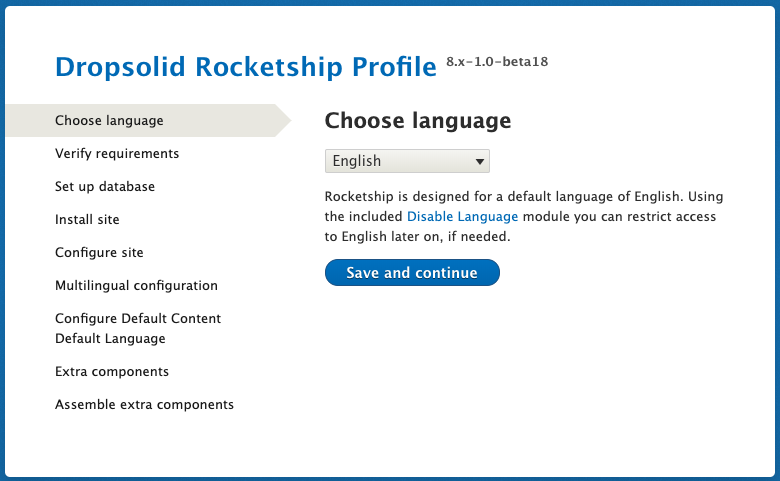
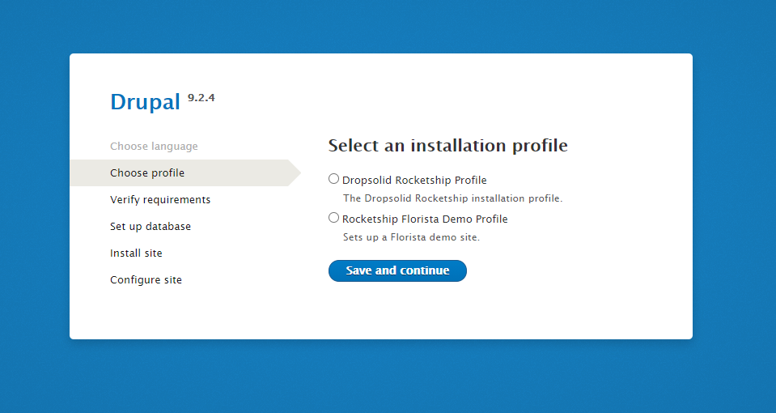
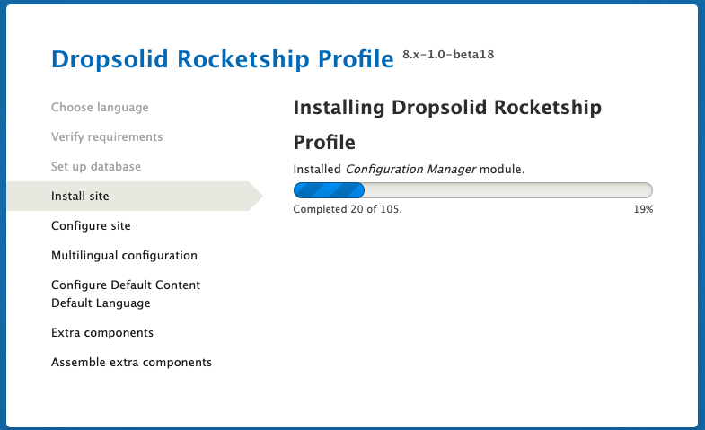
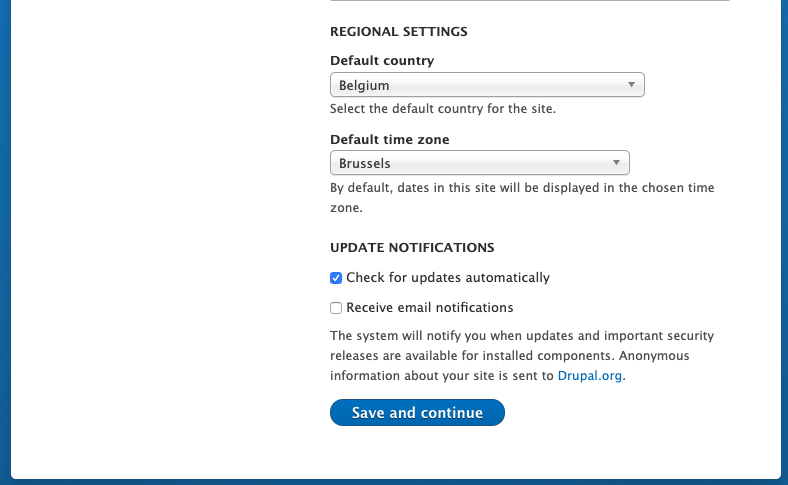
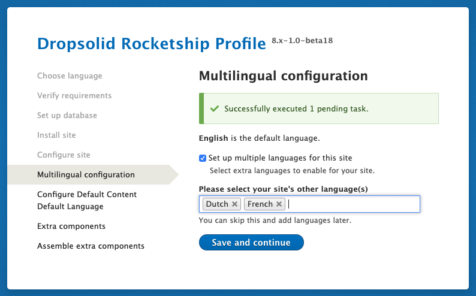
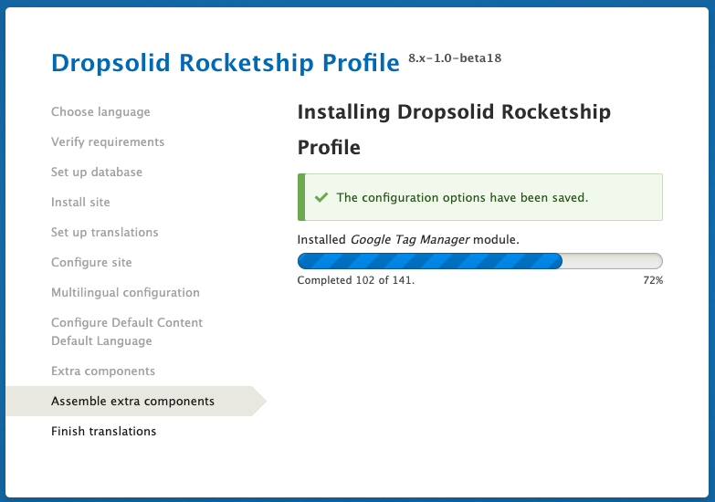
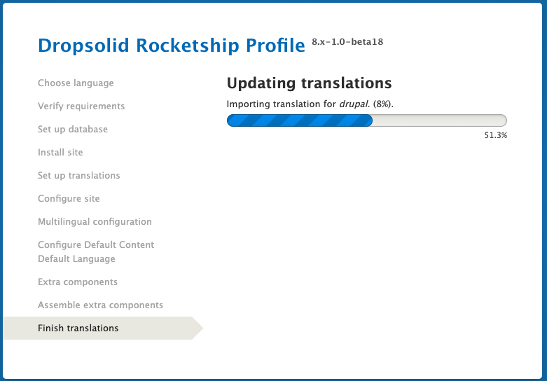
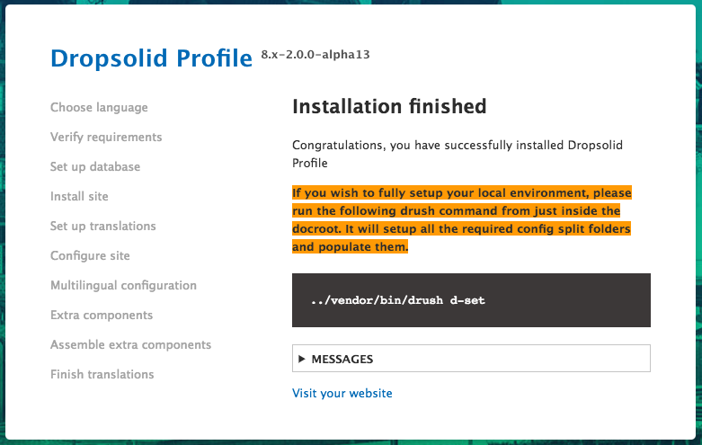
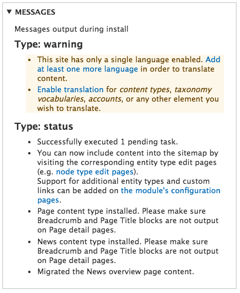

# How to install

- [How to install](#how-to-install)
    - [Via the UI](#via-the-ui)
        - [step 1: Choose language](#step-1-choose-language)
        - [step 2: Verify requirements](#step-2-verify-requirements)
        - [step 3: Set up database](#step-3-set-up-database)
        - [step 4: Install site](#step-4-install-site)
        - [step 5: Configure site](#step-5-configure-site)
        - [step 6: Multilingual configuration](#step-6-multilingual-configuration)
        - [step 7: Extra components](#step-7-extra-components)
        - [step 8: Assemble extra components](#step-8-assemble-extra-components)
        - [step 9: Finish translations](#step-9-finish-translations)
        - [(Almost) done](#almost-done)
    - [Via drush](#via-drush)

## Via the UI

Like any Drupal site, you can surf to /core/install.php and go through the 
steps.

If you end up on this screen, drop all the tables in the database and 
afterwards, go back to the install page.

### step 1: Choose language

By default, we use English. Even if you're building a single language site 
in Dutch, it is best to set everything up in English and add Dutch as an 
additional language. This prevents several bugs with multilingual + makes it easier on your non-dutch-speaking coworkers.  
If you don't want to use English as a language, you can disable the English language after your site development is finished, using the `disable_language` module, WITHOUT CHANGING ITS DEFAULT STATUS.
 
To reiterate: **NEVER SWITCH THE DEFAULT LANGUAGE IN DRUPAL LANGUAGE CONFIGURATION!**

### Step 1.5: Select profile
There are two profiles to choose from, one that sets up a demo site and one that
installs a site ready to develop/site build. Choose "Dropsolid Rocketship Profile" when
starting a new project.

### step 2: Verify requirements

Fix any errors or warnings that come up

### step 3: Set up database

You normally won't land on this screen.

### step 4: Install site

you can follow the progress of Drupal going through the installation.

### step 5: Configure site

Fill in the form where needed:
- replace with the client's email address if you already have one

**Important note:**
User 1 (admin) does not get a password in rocketship projects. This is for security reasons. Our preferred flow is to have developers log in as user 1 using drush or users on the Platform to get a login using the project's "login" button.

### step 6: Multilingual configuration

Rocketship is set up as multilingual by default. The required modules are 
always enabled, and all that's required at any point in time is to just enable
an extra language.

If you already know what languages you will use for this site, set them up now.
This will place the language switcher block in the correct region.

If your project requires you to use 'disable language' to remove the English language, the editor still needs to be able to find the content that was originally created in English during site installation. Eg. the 404 and 403 page or any default generated content (more on that later).  
For this reason, there is an option to set a 'default content language', which will set the original language for those migrated bits of content into your chosen language (eg. Dutch). Otherwise, if the content remains set as 'English', the editor won't have access to it and won't be able to translate them.

### step 7: Extra components

Here you can select any extra components + generate dummy content. This includes our pre-made features,
and the option to select what theme to use.

**For Dropsolid internal use:**

At the very least, you can add these settings to get started:

- **Blocks**: Core, this will give you a large amount of custom block types to use with layout builder
- **Core**: Core + Content. That way you have a dummy homepage, 404 and 403 
to start from
- **Page**: Every site needs to be able to use pages
- **Theme**: Rocketship Flex, Starter or Minimal for development.

### step 8: Assemble extra components

This will take a while. See the progress on the installation of the extra 
components.

### step 9: Finish translations

Rest of the translation stuff getting done, more waiting…

### (Almost) done

Before you can be finished, you have to set up the config split. This is
done using `../vendor/bin/drush d-set`.

For this to work, make sure the following folders are writable:

- config/sync
- config/splits/local
- config/splits/dev
- config/splits/staging
- config/splits/live
- config/splits/whitelist

Read more about this in the 
**[Configuration Management](../after-install/#configuration-management) 
section**

